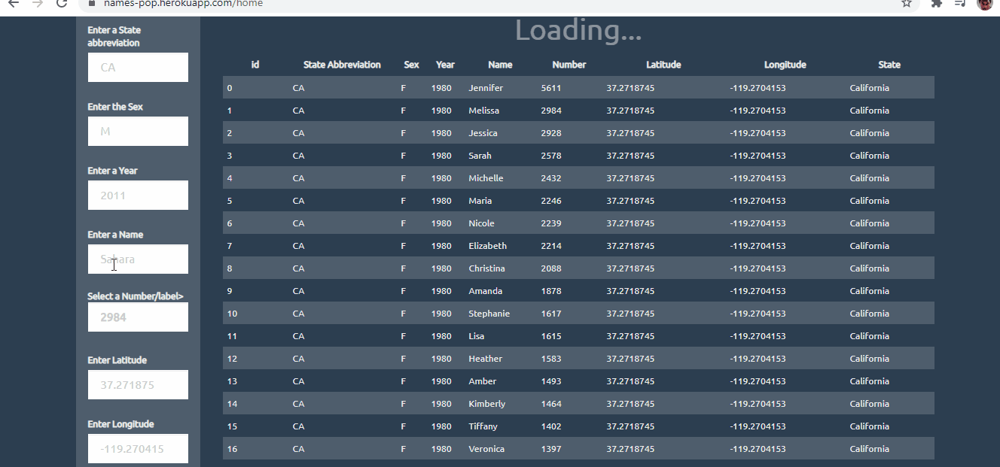
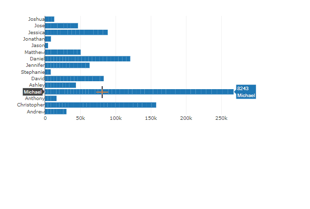
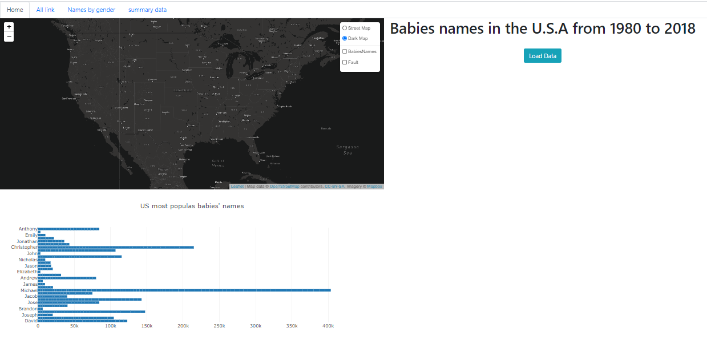

# Baby_Names_Visualization 

## Project Goal :

The goal of the project is to visualize the most popular babies'names  (by state and per year) from 1980 to 2018.

## Work Process 

#### ETL: EXTRACT - TRANSFORM - LOAD

* Extraction:
  We extracted our first tables from the social security website. We had roughly 52 tables in total. Our second table is the USA latitude and longitude for each state that we extracted from Kaggle.

    + Sources:
  
       - https://www.kaggle.com/washimahmed/usa-latlong-for-state-abbreviations

       - https://www.ssa.gov/oact/babynames/decades/century.html

* Transform:
  
Our data was a report of the US babies' names by state from 1910 to 2018 and hopefully, we didn't have empty rows. The work consisted of cleaning the data by converting the text files to CSV, removing unnecessary columns, combining the table, and selecting the desired data to work with.

* Load:
we used PostgreSQL as our database

### Heroku-Postgres 

This step consisted of uploading our data in the cloud through the connection of Heroku  with Postgres 

### Working with Python and Flash-Sqlalchemy 

At this stage, we needed to create a python API that will generate the HTML file, the link of our _jsonified_ data, and the structure of our application on Heroku. 

### VIsualization

+ HTML

+ CSS

+ Javascript

**home**   dynamic table that  displays the input of the user 

 
**Map&graph**   displays the most popular babies' names since 1980 and a leaflet map that shows names by state and year since 1980.

